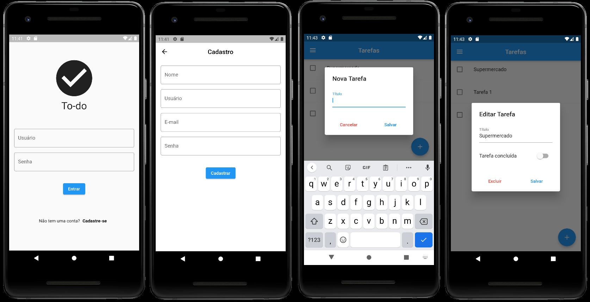

# PHP API TO-DO-LIST v.2.0

<code></code>
<code></code>


Esta API tem como objetivo apresentar um breve guia para consumir recursos de uma API, principalmente para estudantes nos primeiros anos de cursos de Ciência da Computação e similares. Por essa razão, possui poucos EndPoints para uso e pode ser expandida de acordo com a necessidade.

A API possui duas funcionalidades: "USUÁRIO" e "TAREFA". O objetivo é que um usuário possa registrar sua lista de tarefas, realizando manipulação básica de dados em ambos os recursos. Como um bônus, a API permite, após a criação do usuário, o envio de uma imagem para o perfil do usuário.

Como é um projeto instrucional, não é recomendável que seja aplicado em um ambiente de produção, pois rotinas de segurança e testes não foram implementados. Esses recursos devem ser pesquisados e implementados, seguindo as regras atuais, além das boas práticas. Construído em PHP 7 (veja abaixo), permite que o iniciante entenda os mecanismos de acesso aos recursos de uma API.

```html
PHP 7.4.3 (cli) (built: Jul  5 2021 15:13:35) ( NTS )
Copyright (c) The PHP Group Zend Engine v3.4.0, 
Copyright (c) Zend Technologies with Zend OPcache v7.4.3, 
Copyright (c), by Zend Technologies
```

## Como usar este conteúdo?
Este conteúdo possui licença gratuita para uso (CC BY-SA 4.0).

Se você deseja colaborar com melhorias neste repositório, basta fazer um Fork e enviar Pull Requests.

# Composer
As alterações devem ser atualizadas via <code>composer dump-autoload -o</code> em sua máquina local.

# Documentação
Esta API fornece funcionalidade para criar e manter usuários para controlar um aplicativo simples de lista de tarefas. A seguir, mostra a estrutura da API para os recursos usuários e tarefas.

# Estrutura da API

```text
+---api
    \task\
        ---delete
        ---edit
        ---new
        ---search
        ---update
    \user\
        ---new
        ---login
        ---update
        ---updateuserpass
        ---delete
+---src
    \---Database
    \---Helpers
    \---Task
    \---User
\---vendor
    \---composer
```

## Database

The development uses the MySQL 5, which can be changed at any time according to the need for use. The database should be
configured in <code>Database\Database.php</code>

### Scripts SQL

```sql
CREATE DATABASE name;
```

```sql
CREATE TABLE users
(
    id       INT(3)         NOT NULL PRIMARY KEY AUTO_INCREMENT,
    name     VARCHAR(50)    NOT NULL,
    email    VARCHAR(50)    NOT NULL,
    username VARCHAR(32)    NOT NULL,
    password VARCHAR(32)    NOT NULL,
    token    VARCHAR(20)    NOT NULL,
    picture  TEXT           DEFAULT NULL
);
```

```sql
CREATE TABLE tasks
(
    id       INT(3)         NOT NULL PRIMARY KEY AUTO_INCREMENT,
    userId   INT(3)         NOT NULL,
    name     VARCHAR(50)    NOT NULL,
    date     date           NOT NULL,
    realized INT(1)         NOT NULL
);
```

Attention: in order to delete corresponding tasks to user you need to do a ```ALTER TABLE``` adding a ```FOREIGN KEY``` and ```ON DELETE CASCADE``` option.

```sql
ALTER TABLE tasks
ADD CONSTRAINT pk_user
FOREIGN KEY (userId)
REFERENCES users(id)
ON DELETE CASCADE;
```

## Token

To use this API, a user must first be created with resource below.

A TOKEN will be returned that should be used in all subsequent requests for both user and task data manipulation.

## Domain

The `domain` variable must be filled with the address where the API will be made available like: (<code>https://**domain**/api/{resource}/{parameter}</code>)

# __User__ resources

## **NEW**

* parameter: **user/new**/
* method: **post**
* payload

  ```json
  {
    "name": "name",
    "email": "email",
    "username": "username",
    "password": "password"
  }
  ```

* header

  ```json
  {"content-type": "application/json"}
  ```

* success

  ```json
  {
    "message": "User Successfully Added",
    "id": "user_id",
    "token": "YOUR_TOKEN"
  }
  ```

* warnings

  ```json
  {"message": "Invalid Arguments Number (Expected Four)"}
  {"message": "Could Not Add User"}
  {"message": "User Already Exists"}
  ```


## **LOGIN**

* parameter: **user/login**/
* method: **post**
* payload

  ```json
  {
    "username": "username",
    "password": "password"
  }
  ```

* header

  ```json
  {"content-type": "application/json"}
  ```

* success

  ```json
  {
    "id": 1,
    "name": "John Doe",
    "email": "john.doe@domain.com",
    "token": "YOUR_TOKEN",
    "picture": "BASE64_STRING"
  }
  ```

* warnings

  ```json
  {"message": "Invalid Arguments Number (Expected Two)"}
  {"message": "Incorrect username and/or password"}
  ```
  
## **UPDATE**

* parameter: **user/update/**
* method: **put**
* payload

  ```json
  {
    "name": "name",
    "email": "email",
    "username": "username",
    "password": "password",
    "picture": "BASE64_STRING" or ""
  }
  ```

* header

  ```json
  {
    "content-type": "application/json",
    "Authorization": "YOUR_TOKEN"
  }
  ```

* success

  ```json
  {"message": "User Successfully Updated"}
  ```

* warnings

  ```json
  {"message": "Invalid Arguments Number (Expected Five)"}
  {"message": "Incorrect username and/or password"}
  {"message": "Could Not Update User"}
  ```

## **UPDATE USERNAME/PASSWORD**

* parameter: **user/updateuserpass/**
* method: **put**
* payload

  ```json
  {
    "username": "username",
    "password": "password",
    "new_username": "new_username",
    "new_password": "new_password"  
  }
  ```

* header

  ```json
  {
    "content-type": "application/json",
    "Authorization": "YOUR_TOKEN"
  }
  ```

* success

  ```json
  {"message": "User/password Successfully Updated"}
  ```

* warnings

  ```json
  {"message": "Invalid Arguments Number (Expected Four)"}
  {"message": "Incorrect username and/or password"}
  {"message": "Could Not Update Username/password"}
  ```

## **DELETE**

* parameter: **user/delete/**
* method: **delete**
* payload

  ```json
  {
    "username": "username",
    "password": "password"
  }
  ```

* header

  ```json
  {
    "content-type": "application/json",
    "Authorization": "YOUR_TOKEN"
  }
  ```

* success

  ```json
  {"message": "User Successfully Deleted"}
  ```

* warnings

  ```json
  {"message": "Invalid Arguments Number (Expected Two)"}
  {"message": "Incorrect username and/or password"}
  {"message": "Could Not Delete User"}
  ```

# __Task__ resources

## **NEW**

* parameter: **task/new**/
* method: **post**
* payload

  ```json
  {"name": "Task name"}
  ```

* header

  ```json
  {
    "content-type": "application/json",
    "Authorization": "YOUR_TOKEN"
  }
  ```

* success

  ```json
  {"message": "Task Successfully Added"}
  ```

* warnings

  ```json
  {"message": "Invalid Arguments Number (Expected One)"}
  {"message": "Could Not Add Task"}
  ```

## **SEARCH**

* parameter: **task/search**/
* method: **post**
* payload
  * Payload is not necessary, as the control is performed by `token`.
  * Realized field accept values: `0` (open) or `1` (realized)

* header

  ```json
  {
    "content-type": "application/json",
    "Authorization": "YOUR_TOKEN"
  }
  ```

* success

  ```json
  [
    {
      "id": 1,
      "userId": 1,
      "name": "task name",
      "date": "2021-08-16",
      "realized": 0
    }
  ]
  ```

* Warnings

  ```json
  {"message": "Task(s) not found"}
  ```

## **UPDATE**

* parameter: **task/update**/
* method: **put**
* payload

  ```json
  {
    "id": "value",
    "name": "Task name",
    "realized": "value"
  }
  ```

* header

  ```json
  {
    "content-type": "application/json",
    "Authorization": "YOUR_TOKEN"
  }
  ```

* Success

  ```json
  {"message": "Task Successfully Updated"}
  ```

* Warnings

  ```json
  {"message": "Task(s) not found"}
  {"message": "Method Not Allowed"}
  {"message": "Invalid Arguments Number (Expected Three)"}
  ```

## **EDIT**

* parameter: **task/edit**/
* method: **put**
* payload

    ```json
    {"id": "value"}
    ```

* header

  ```json
  {
    "content-type": "application/json",
    "Authorization": "YOUR_TOKEN"
  }
  ```

* Success

  ```json
  {
  "id": 2,
  "userId": 1,
  "name": "Task name",
  "date": "2021-08-16",
  "realized": 0
  }
  ```

* Warnings

  ```json
  {"message": "Payload Precondition Failed"}
  {"message": "Invalid or Missing Token"}  
  {"message": "Invalid Arguments Number (Expected One)"}
  {"message": "Bad Request (Invalid Syntax)"}
  {"message": "Token Refused"}
  ```

## **DELETE**

* parameter: **task/delete**/
* method: **delete**

* payload

  ```json
  {"id": "id_task"}
  ```

* header

  ```json
  {
    "content-type": "application/json",
    "Authorization": "YOUR_TOKEN"
  }
  ```

* Success

  ```json
  {"message": "Task deleted Successfully"}
  ```

* Warnings

  ```json
  {"message": "Task not exist"}
  {"message": "Payload Precondition Failed"}
  {"message": "Invalid or Missing Token"}  
  {"message": "Invalid Arguments Number (Expected One)"}
  ```


### Other Warnings

```json
{"message": "Bad Request (Invalid Syntax)"}
{"message": "Token Refused"}
{"message": "Invalid or Missing Token"}
{"message": "Method Not Allowed"}
{"message": "<SQL Code>"}
{"message": "<Unknown>"}
```


<a name="tryonline"></a>

# Try Online

You can try online this API with full features.

* URI: [https://todolist-api.edsonmelo.com.br/api/](https://todolist-api.edsonmelo.com.br/api/)

---

## Flutter APP ToDoList

You can test the API functionalities by accessing [here](https://github.com/Wilian-N-Silva/flutter_to_do_list) the APP developed by [Wilian Silva](https://github.com/Wilian-N-Silva).

### Views


___

## How to cite this content

```
DE SOUZA, Edson Melo (2021, August 16). PHP API TO-DO-LIST v.2.0.
Available in: https://github.com/EdsonMSouza/php-api-to-do-list
```

Or BibTeX for LaTeX:

```latex
@misc{desouza2020phpapi,
  author = {DE SOUZA, Edson Melo},
  title = {PHP API TO-DO-LIST v.2.0},
  url = {https://github.com/EdsonMSouza/php-api-to-do-list},
  year = {2021},
  month = {August}
}
```

## Acknowledgements

* [Arthur Timoteo](https://github.com/arthur-timoteo)
  
* [Wilian Silva](https://github.com/Wilian-N-Silva)

## License

[![CC BY-SA 4.0][cc-by-sa-shield]][cc-by-sa]

This work is licensed under a
[Creative Commons Attribution-ShareAlike 4.0 International License][cc-by-sa].

[![CC BY-SA 4.0][cc-by-sa-image]][cc-by-sa]

[cc-by-sa]: http://creativecommons.org/licenses/by-sa/4.0/

[cc-by-sa-image]: https://licensebuttons.net/l/by-sa/4.0/88x31.png

[cc-by-sa-shield]: https://img.shields.io/badge/License-CC%20BY--SA%204.0-lightgrey.svg


